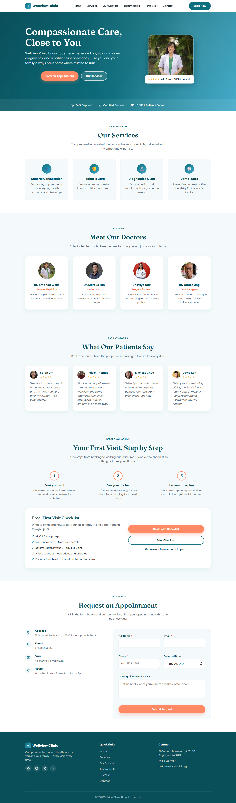

# Wellview Clinic

A single-page marketing site for **Wellview Clinic**, a fictional Singapore healthcare clinic. Built as one self-contained `index.html` — no build step, no dependencies, no backend.

🔗 **Live site:** https://deane-ms.github.io/healthcare/ (deployed automatically to GitHub Pages on every push to `main`)



## Sections

- **Navbar** — sticky, with a mobile hamburger menu
- **Hero** — headline, CTAs, and a trust strip (support hours, certifications, patients served)
- **Services** — general consultation, pediatric care, diagnostics & lab, dental care
- **Meet Our Doctors** — team profiles with photo, specialty, and bio
- **Testimonials** — patient quotes and star ratings
- **Your First Visit** (`#first-visit`) — a 3-step visit journey plus a free, ungated "First Visit Checklist" lead magnet (real client-side download/print, no backend required)
- **Enquiry form** (`#contact`) — client-side validated appointment request form
- **Footer** — quick links, contact details, social links

## Getting started

There's nothing to install or build. To preview the site locally, just open `index.html` in a browser:

```
Start-Process index.html
```

or double-click the file in Explorer.

> The page hotlinks all photos from `images.unsplash.com`, so an internet connection is needed to see images render.

## Deployment

Pushing to `main` triggers [`.github/workflows/deploy.yml`](.github/workflows/deploy.yml), which publishes the repository root to **GitHub Pages**. No build step runs — the static files are uploaded as-is.

## Tech

- Plain HTML5, CSS3 (custom properties for theming), and vanilla JavaScript
- No frameworks, package manager, or bundler
- Type pairing: Fraunces (display headings) + Poppins (body/UI), loaded from Google Fonts
- Accessibility touches: skip link, `aria-*` attributes, focus-visible styles, `prefers-reduced-motion` support
- Scroll-triggered, staggered fade-in animations via `IntersectionObserver`
- SEO: meta description, Open Graph/Twitter tags, canonical link, `MedicalClinic` JSON-LD structured data, `robots.txt` and `sitemap.xml`
- Images use `loading="lazy"` + explicit `width`/`height` below the fold to avoid layout shift; the hero photo is `fetchpriority="high"`

## Regenerating the screenshot

`assets/screenshot.png` is a full-page capture of `index.html`, taken with the Playwright MCP server configured in [`.mcp.json`](.mcp.json) (`@playwright/mcp`). Fade-in sections are hidden until scrolled into view, so capture with `prefers-reduced-motion: reduce` emulated (or scroll through the page) to render every section before screenshotting.

## Notes for contributors

- Everything lives in `index.html`, organized with HTML comment banners (e.g. `<!-- ================= HERO ================= -->`) marking each section — use these to navigate instead of searching class names.
- The enquiry form validates client-side only; on successful submission it logs the data to the console. The code marks exactly where a real `fetch('/api/appointments', ...)` call would go once a backend exists.
- See [CLAUDE.md](CLAUDE.md) for more detailed architecture and conventions notes.
